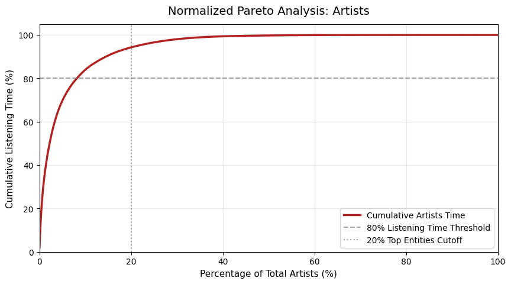
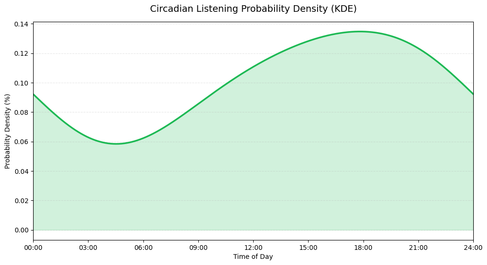

# Data Analysis on Spotify Streaming History

A series of Jupyter notebooks aimed at applying data science concepts to my own streaming history using pandas.

## Core Capabilities Demonstrated

* **Data Infrastructure & Tools:** Python, Pandas, Matplotlib, Requests, Jupyter
* **Data Engineering & ETL:** Extract-Transform-Load (ETL) pipelines, Time-Series Filtering, Defensive API Consumption, Multi-Label Normalization
* **Statistical Analysis & Visualization:** Distribution Modeling (Pareto), Vectorized Operations, Custom Dual-Axis & Normalized Plotting

---

## Notebook Breakdown

### `pareto.ipynb`

 * **Statistical Distribution Analysis**: Quantified listening concentration using the Pareto Principle (80/20 rule), proving that top artists severely overperform the baseline by accounting for ~94% of total stream time.
 * **Multi-Label Normalization**: Mitigated co-occurrence bias in crowdsourced Last.fm subgenre tags, resolving artificial long-tail inflation caused by non-mutually exclusive entity mappings.
 * **Edge-Case Resolution**: Resolved zero-slicing and integer truncation errors during fractional percentile calculations by enforcing defensive rounding controls.
 * **Custom Visualization Engineering**: Developed modular Matplotlib functions to generate normalized Pareto charts ($0–100\%$ rank scale) and comparative Lorenz curves, visualizing listening inequality across artists, tracks, and genres.

### `circadian.ipynb`

 * **End-to-End Time-Series ETL & Circular Modeling:** Parses multi-year Spotify timestamps, partitioning activity into discrete 24-hour intervals, and applies a 72-hour cyclic padding technique to eliminate midnight boundary truncation artifacts in Gaussian Kernel Density Estimation (KDE).
 * **Non-Parametric Signal Processing:** Employs `scipy.signal.find_peaks` with height and prominence thresholding to accurately detect local maxima, programmatically isolating primary and secondary listening peaks (e.g., 16:00 and 22:00) from continuous probability density functions.
 * **Behavioral Metric Engineering:** Quantifies session engagement by mapping streaming reason codes (`reason_end == 'fwdbtn'`) into hourly track skip ratios, measuring baseline stability against an overall mean.
 * **Information-Theoretic Diversity Profiling:** Integrates external metadata by mapping Last.fm genre tags to top artists and implementing Normalized Shannon Entropy ($H / \log_2 N$) across hourly distributions to mathematically evaluate listening focus versus genre exploration across the day.

 ### `wrapped.ipynb`

 * **Spotify Wrapped Analytics**: Developed consumption dashboards for top artists and genres. Standardized data accuracy by implementing composite grouping (Track + Artist) to eliminate misattribution errors caused by track title collisions, ensuring data integrity in final rankings.

 * **Vectorized Mapping**: Developed a high-speed lookup pipeline using Pandas `.map()` to cross-reference local historical data with external music metadata.

 * **Robust API Integration**: Consumed the Last.fm REST API to fetch crowdsourced genre data, implementing defensive exception handling to manage missing fields and empty payloads cleanly.

 * **Data Optimization**: Implemented strict volume thresholds (top 150 artists) to maximize script execution speeds and prevent API rate-limiting blocks.

 ### `data-cleaning.ipynb`

 * **Noise Reduction**: Isolated core music streaming logs by identifying and removing non-music anomalies (audiobooks and podcasts), ensuring no data pollution in downstream models.

 * **Schema Optimisations**: Streamlined the dataframe by stripping non-essential metadata columns, reducing memory overhead and improving array-processing efficiency

 * **Temporal Data Parsing**: Converted string-based ISO 8601 timestamps into native Pandas datetime objects, allowing for more efficient processing and easier handling

 * **Parametric Data Segmentation**: Engineered a reusable filtering pipeline to dynamically filter logs by year, establishing a framework for multi-year analysis